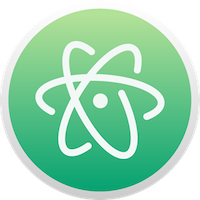

# Using Atom
{: .fs-8 }

How to set up and use Atom from writing markdown
{: .fs-6 .fw-300 }

---

Atom is my fave editor for all types of "code". Python, bash, markdown, html... I've not tried with LaTeX, but I wouldn't be surprised if it can handle that. My guess is it probably can't handle MATLAB, but that's cool.

What I particularly love about Atom is that I can switch between different languages very comfortably (which I have to do a a fair amount for work), and Atom takes care of everything the same way, no matter what you are writing. It handles the colours, the spacing, the formatting, linting, the keyboard shortcuts, autocompletions, commenting, spell checking, searching / find+replace across multiple files, all the important stuff! I guess that is what you get from an open source tool developed by and for users who write code for a living! Other tools are available which I'm sure do a great job, but this is the one I am most comfortable with and consistently pleased by.

To host your documentation on GitHub pages, you're going to be writing across multiple documents. Atom also has a directory tree on the left which enables you to navigate around your project (and do things like create and delete files using the mouse) really easily.

Atom also provides a graphical "point and click" way of committing changes to your GitHub repo. This can be useful if you're not familiar with the process, but for these tutorials we're going to stick to command line and the terminal for GitHub, because you get better error reports.

Before we crack on with the docs, I'd love for you to get familiar with working in Atom. Here's a short video which shows you how to [install and start using Atom](https://www.youtube.com/watch?v=EyG20hhON6E).

There are tones of packages you can add on to make your workflow easier, but for these tutorials you'll only need the markdown basics which come preloaded.

Thanks, Atom. We love ya.
