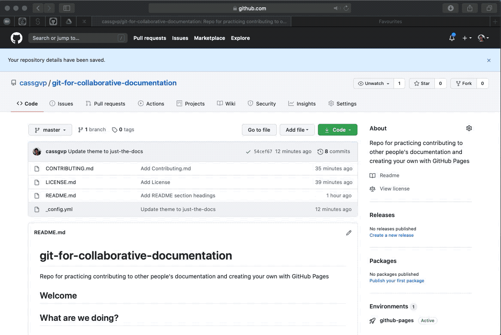
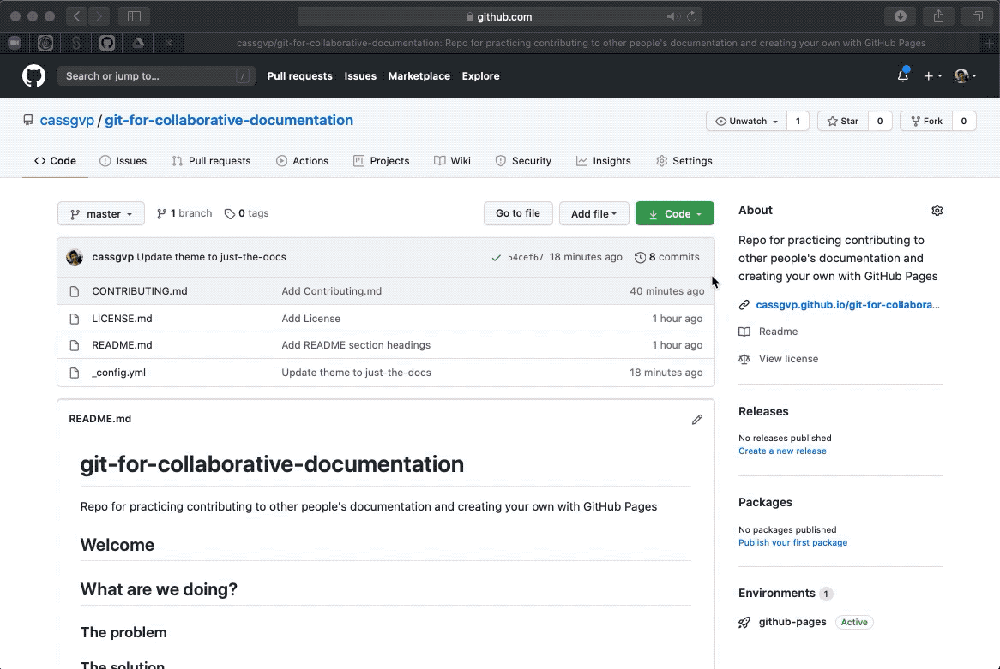
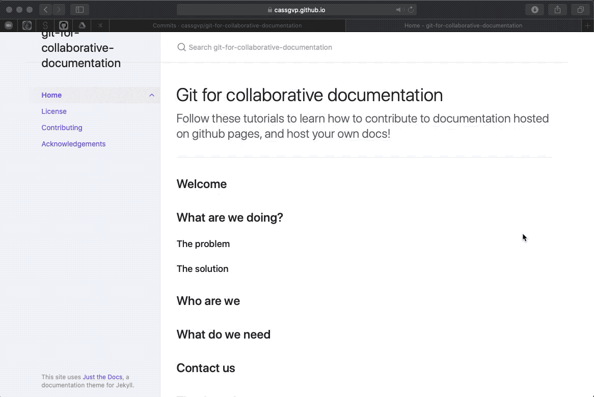

# Make your own documentation
{: .fs-8 }

Make your own documentation repository and turn it into a GitHub Pages site
{: .fs-6 .fw-300 }

---

## 1. Make your GitHub repository

Every GitHub pages site starts off as a simple repository.

Create a new repository for your documentation by going to your repositories and selecting "New".

Next git it a name, description, and add a README file. I've chosen not to add a license here as I have a preference for one which is not in the list of default licenses provided by GitHub.

Click "Create Repository" Ta-da! You have a repository! 🎉


## 2. Update your README.md

Your README is your landing page for your repository on GitHub. Depending on the Pages theme you chose, it may also be rendered as the "home" page on your site.

Your README should contain all the information someone needs to understand what your project is about and how they can contribute. Some suggested section headings for your README are below.

- Welcome
- What are we doing
  - The problem
  - The solution
- Who are we
- What do we need
- Contact Us
- Find out more
- Thank you

To get a quick outline of the README structure (and to differentiate it from the one automatically created by GitHub), I have chosen to edit the page in GitHub directly, and add the section headings in [Markdown](https://github.com/adam-p/markdown-here/wiki/Markdown-Cheatsheet).

To save your changes, describe what you did in the commit message, then press "commit"


## 3. Create a LICENSE.md

A license file is essential to indicate to others how you want your repository to be reused and credited.

To get the license file in place, I'm going to use the "add file" function and add a title and a link to the CC-BY legal wording.

To save your changes, describe what you did in the commit message, then press "commit"


## 4. Create a CONTRIBUTING.md

A contributing file is essential to let other know what you would like help with and how you would like people to contribute.

To get the contributing file in place, I'm going to use the "add file" function and simply add a title. I'll fill in the details later!

To save your changes, describe what you did in the commit message, then press "commit"


## 5. Turn your repo into a GitHub Pages site!

Now the magic! Turn this simple collection of files into something which looks like a user friendly (and not GitHub scary!) website!

Go into your site settings and scroll down to the "GitHub Pages section". Change the "Source" into your "master" branch and click "save".

Next click "Choose a theme" and pick from one of the preselected options provided by GitHub. One of these theme might be fine for your purposes but there are hundreds of other free themes we can chose from (more about that below). For now, I'm going to pick a theme at random, as this will create the necessary file we need to modify to put in our own selection of theme.

Click "Select Theme" to return to your setting page. You will now see that the URL of your pages site is listed under the GitHub Pages section. Take A look!

Woohoo! You have a website! 🎉


## 6. Change your theme

There are hundreds of different (free!) jekyll theme to play around with. Some are intentionally designed for documentation, with simple navigation and minimal "frills". Others are designed for blogs with the regular addition of tagged posts. Others are designed for graphical portfolios, with an emphasis on bold pictures. Take a look around [https://jekyllthemes.io/free](https://jekyllthemes.io/free) to see which you like!

If you chose to use a theme other than one GitHub already supports, you can use this as a "remote" theme. This simply means you have to tell GitHub where the theme is hosted (where the developed keeps all the code!) and point your page to that address. Take a look at this [blog about remote themes to learn more](https://github.blog/2017-11-29-use-any-theme-with-github-pages/).

To change your theme, update the "_config" file which was created automatically by GitHub when you created your pages site. Edit this file in GitHub directly to include the "remote_theme" tag (as described on the [remote themes blog](https://github.blog/2017-11-29-use-any-theme-with-github-pages/)), and the name of the developer and theme you have chosen (the name of their repository).


While you're here, it's a good idea to add the URL of your pages site to the "About" description on your GitHub repository. This is useful to help people find your pages site if they land on your repository first. Remember, your GitHub repository and your Pages site both exist as separate entities (at separate URLs), with the content repeated on both but "rendered" differently at each URL.




## 7. Clone your repository to make a local copy

At the moment, your repository exists only online. This is fine for basic editing, but it you want to be able to work on your site and documentation offline, you'll want to have a copy of everything on your own computer. You can also use some neat tools for editing markdown once you have a copy of the repository locally.

Getting a local copy of your repository is called "cloning" in GitHub terms.

To clone your repository to your local computer, click the "Code" button on your GitHub page, and click the button to copy the https address of your repository.

Next in your terminal navigate to where you want your repository code to live and enter the below:
```
git clone [https address for your repo]
```

Boom! You have a local copy of your code 💃.



Now dig into the "how to" guide of your chosen theme to learn what you can add to make your pages site 💯.

Pro-tip: Search the internet for examples where other people have used the same theme as you, then did about in their GitHub repository to see how they achieved it. You can simply search for the "theme tag" which is often automatically rendered (and not removable) from free jekyll theme sites. For example: "This site uses Just the Docs, a documentation theme for Jekyll."

In the below I've edited my repo in atom. I've added a few pages, and the front matter (text at the top) to define the order I want pages to appear in, and whether they should have sub-pages ("children").

Once you've made a few changes, simply add, commit and push them to your repo!


It takes a little while for your pushed changes to appear on your site (especially if they are more complex things than adding/removing words). Be patient ⏳. Wait for them to arrive and see what you have created!



## 8. Tweak your theme and content as you wish!

You are now a GitHub Pages and documentation hero! 🙌🏻 🙌🏼 🙌🏽 🙌🏾 🙌🏿

Edit your pages and play with your theme. The site you are now reading is the same which I started in the recordings above, just now it's pretty 🌺

Don't forget to add, commit and push your changes at regular intervals to see how they have taken effect. It might be easiest to start with little changes and get your structure right before attempting anything to grand!

Some themes prefer just markdown, but most (maybe all?!) will also accept html, so anything which can be achieved in html can also go into your GitHub Pages site.

Go forth and document, with version control! 🤘🏻 🤘🏼 🤘🏽 🤘🏾 🤘🏿
